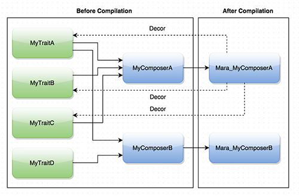

Mara
=====================


Mara is a library to provide traits or composition capabilities to your Android or Java projects.

But at first place allow me tell who's Mara. Mara is my little princess, she's the first of my two
sons and this library is dedicated to she. I love you my princess.

## Latest Version

[  ](https://bintray.com/txusballesteros/maven/mara/_latestVersion) [](https://android-arsenal.com/details/1/1949)

## Why?

Why I do this library, many times I think about how I can do reusable components for my projects and
how it can be isolated from all of the rest. A month ago someone show me [Kotlin](http://kotlinlang.org),
a language created by JetBrains and based 100% on JVM. And I thought how I can migrate the Traits
capability from Kotlin to Java. The answer to the question is this library.


## How it Works



## How to use

### Configuring your project

Configure the APT plugin on your build.gradle file.

```groovy
buildscript {
    repositories {
        mavenCentral()
    }
    dependencies {
        classpath 'com.neenbedankt.gradle.plugins:android-apt:1.4'
    }
}

apply plugin: 'com.android.application'
apply plugin: 'com.neenbedankt.android-apt'
```

Add the library dependencies.

```groovy
dependencies {
    ...
    compile 'com.txusballesteros:mara:0.1'
    apt 'com.txusballesteros:mara-compiler:0.1'
}
```

### Let's play

Creating your first Trait.

```java
@Trait
public class MyFirstTrait {
    public void MyMethod() {
        ...
    }
    ...
}
```

Creating your first Composer.

```java
@TraitComposer(
    traits = {
            MyFirstTrait.class,
            ...
    }
)
public interface MyComposer { }
```

Consuming your Composer and your injected Traits.

```java
public class MyApp {
    public void onCreate() {
        Mara_MyComposer myComposer = new Mara_MyComposer.Builder().build();
        myComposer.MyMethod();
    }
}
```

## Constructor Parameters

If your traits has constructor parameters, don't worry, Mara provides automatically
setters into the composer builder class to allow set this values. Please see the example below.

```java
@Trait
public class MyFirstTrait {
    public MyFirstTrait(Context context) {
        ...
    }

    public void MyMethod() {
        ...
    }
    ...
}
```

```java
@TraitComposer(
    traits = {
            MyFirstTrait.class,
            ...
    }
)
public interface MyComposer { }
```

```java
public class MyApp {
    public void onCreate() {
        Mara_MyComposer myComposer = new MyComposer.Builder()
                                        .setContext(...) // This setter has been mapped
                                        .build();        // to your constructor parameter automatically.
    }
}
```

## Mixing Traits

Imagine that you have two or more traits with one or more methods with the same signature. Mara
can solve that stage doing method mixing. When you add some traits to a composer and these have
this condition, the compiler only generate a method and call automatically to all trait with
this signature. Please see the example below.

```java
@Trait
public class MyFirstTrait {
    public void initialize() {
        ...
    }
    ...
}

@Trait
public class MySecondTrait {
    public void initialize() {
        ...
    }
    ...
}
```

```java
@TraitComposer(
    traits = {
            MyFirstTrait.class,
            MySecondTrait.class,
            ...
    }
)
public interface MyComposer { }
```

```java
public class MyApp {
    public void onCreate() {
        Mara_MyComposer myComposer = new MyComposer.Builder().build();
        myComposer.initialize();
    }
}
```

If you want to call a method of an specific trait, you can do it. Please see the example below.

```java
public class MyApp {
    public void onCreate() {
        Mara_MyComposer myComposer = new MyComposer.Builder().build();
        myComposer.get(MyFirstTrait.class).initialize();
    }
}
```

## Customizing Traits Builders

In many cases it's possible you will need customize the instantiation of your traits,
for example to be integrated with third party libraries. Well, don't worry because you
can create your own TraitBuilder. Please see the example below.

```java
public class MyTraitBuilder extends TraitBuilder {
    private Context context;

    public MyTraitBuilder(Context context) {
        this.context = context;
    }

    @Override
    protected Collection<Object> onPrepareTraits() {
        Collection<Object> result = new ArrayList<>();
        result.add(new MyFirstTrait(context));
        return result;
    }
}
```

```java
public class MyApp {
    public void onCreate() {
        MyTraitBuilder myTraitBuilder = new MyTraitBuilder(this);
        Mara_MyComposer myComposer = new MyComposer.Builder()
                                            .setBuilder(myTraitBuilder)
                                            .build();
        ...
    }
}
```

## License

Copyright Txus Ballesteros 2015 (@txusballesteros)

This file is part of some open source application.

Licensed to the Apache Software Foundation (ASF) under one
or more contributor license agreements.  See the NOTICE file
distributed with this work for additional information
regarding copyright ownership.  The ASF licenses this file
to you under the Apache License, Version 2.0 (the
"License"); you may not use this file except in compliance
with the License.  You may obtain a copy of the License at

  http://www.apache.org/licenses/LICENSE-2.0

Unless required by applicable law or agreed to in writing,
software distributed under the License is distributed on an
"AS IS" BASIS, WITHOUT WARRANTIES OR CONDITIONS OF ANY
KIND, either express or implied.  See the License for the
specific language governing permissions and limitations
under the License.
 
Contact: Txus Ballesteros <txus.ballesteros@gmail.com>
